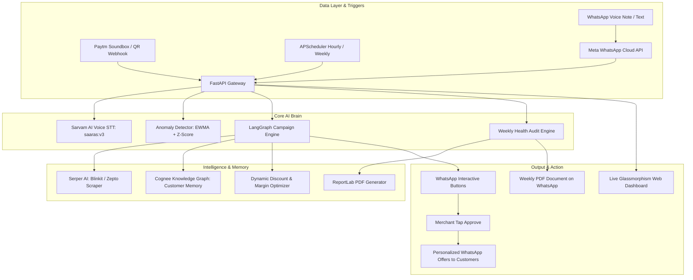

# 🏆 KiranaMate — MerchantMind AI: Hackathon Presentation & Technical Master Guide

> **Target Audience:** Presentation Team & Hackathon Judges  
> **Mission:** The Autonomous Business Teammate for 12+ Million Indian Kirana Stores — Built with 100% Zero-App Friction via WhatsApp Native & Vernacular AI.

---

## 📑 Table of Contents
1. [Executive Summary & Problem Statement](#1-executive-summary--problem-statement)
2. [High-Level Architecture & End-to-End Flow](#2-high-level-architecture--end-to-end-flow)
3. [The 3 Autonomous AI Agents Explained](#3-the-3-autonomous-ai-agents-explained)
4. [Technology Stack & Why We Chose It](#4-technology-stack--why-we-chose-it)
5. [Complete File Directory & 2-to-3 Word Index](#5-complete-file-directory--2-to-3-word-index)
6. [Live Demo Walkthrough (Step-by-Step Script)](#6-live-demo-walkthrough-step-by-step-script)
7. [Anticipated Judge Questions & Bulletproof Answers](#7-anticipated-judge-questions--bulletproof-answers)
8. [The Winning Presentation Pitch (Read Tomorrow)](#8-the-winning-presentation-pitch-read-tomorrow)

---

## 1. Executive Summary & Problem Statement

### The Problem:
- **The Quick-Commerce Threat:** India's 12 Million small neighborhood retail stores (*Kiranas*) are getting crushed by Quick Commerce giants (Blinkit, Zepto, Instamart).
- **Zero Tech Literacy:** Shop owners like "Ramesh ji" work 14 hours a day. They will **never** install, learn, or manage a complex SaaS ERP app or desktop software.
- **Silent Margin Bleed:** 
  1. Perishable stock expires silently on the back shelf (Dead Capital).
  2. Kirana owners don't know competitor pricing in their own pincode.
  3. Millions of Rupees remain stuck in informal customer credit (*Udhar / Khata*).

### The KiranaMate Solution:
**KiranaMate is not another dashboard the merchant has to open.** It is an **Autonomous Business Teammate** that lives inside the only app the merchant already uses 50 times a day: **WhatsApp**.

- **Zero-Friction Voice & Text:** The shopkeeper can simply speak in Hindi (*"Dairy items expire ho rahe hain, sale chalao"* or *"Namaste"*), and KiranaMate understands vernacular Indian dialects.
- **Proactive, Not Reactive:** It doesn't wait for input. It continuously monitors Paytm sales, detects anomalies, scraps competitor prices from Blinkit/Zepto, designs clearance campaigns, and delivers automated weekly audit reports.
- **Human-in-the-Loop:** AI proposes; the merchant approves with a single tap on WhatsApp (`[Run Campaign]` / `[Approve]`).

---

## 2. High-Level Architecture & End-to-End Flow

---

## 3. The 3 Autonomous AI Agents Explained

### Agent 1: Autonomous Sales Anomaly Monitor (`sales_monitor.py`)
- **How it works:** Runs every hour in the background. It calculates an **EWMA (Exponentially Weighted Moving Average)** and dynamic Z-score on hourly Paytm transactions by category (Dairy, Snacks, Staples, Beverages, Personal Care).
- **The Insight:** If Dairy sales are down 40% compared to usual, it doesn't just display a red chart. It triggers an immediate WhatsApp Anomaly Alert directly to the merchant with interactive buttons:
  - `[✅ Run Campaign]` — Immediately spins up Agent 2.
  - `[📊 Details]` — Breaks down the exact rupee gap.
  - `[❌ Ignore]` — Suppresses false alarms.

### Agent 2: LangGraph Campaign Executor (`campaign_executor.py`)
- **How it works:** Built using **LangGraph StateGraph** with cyclic state and human-in-the-loop breakpoints (`interrupt_before`).
- **The Multi-Step Autonomous Pipeline:**
  1. **SKU Matching:** Analyzes inventory to identify products at risk of expiry or overstock.
  2. **Competitor Web Intelligence (`serper_client.py`):** Real-time web search for competitor prices on Blinkit and Zepto in the store's city.
  3. **Margin-Safe Pricing (`discount_calculator.py`):** Calculates the exact discount percentage required to undercut Blinkit while guaranteeing the merchant does not sell below cost.
  4. **Graph Customer Segmentation (`cognee_client.py`):** Queries the Knowledge Graph to find loyal customers who frequently purchase this category.
  5. **Hinglish Message Generation:** Drafts personalized, warm WhatsApp promotional messages with Paytm UPI checkout links.
  6. **Human Approval Interrupt:** Sends the proposal to the shopkeeper's WhatsApp. Pauses execution until the merchant clicks `[Approve]`. Once tapped, it dispatches the offers.

### Agent 3: Weekly Business Health Doctor (`weekly_report.py`)
- **How it works:** Fires every Sunday evening (7 PM IST) or on-demand when the merchant asks *"Report bhejo"*.
- **The 4-Pillar Store Diagnostic:**
  1. **Revenue Health (0–25 pts):** Consistency, growth rate, and daily revenue target fulfillment.
  2. **Inventory & Dead Capital Risk (0–25 pts):** Ratio of slow-moving items expiring within 7 days.
  3. **Customer Retention (0–25 pts):** Repeat visit rate and churn prediction.
  4. **Khata Risk (0–25 pts):** Outstanding credit overdue past 30 days.
- **The Delivery:** Computes a composite **0–100 Health Score**, creates a branded, multi-page vector **PDF Report** using ReportLab, and delivers it natively into the merchant's WhatsApp chat.

---

## 4. Technology Stack & Why We Chose It

| Technology | What It Does | Why We Chose It (Presentation Defense) |
| :--- | :--- | :--- |
| **FastAPI + Uvicorn** | Backend Web Framework & API Gateway | Ultra-fast asynchronous I/O; perfectly handles simultaneous Paytm webhooks, Meta incoming requests, and SSE streaming to the live dashboard. |
| **Meta WhatsApp Cloud API** | Merchant & Customer Communication | Zero app adoption friction. The merchant already knows how to use WhatsApp; no training required. |
| **Sarvam AI (`saaras:v3`)** | Vernacular Indian Speech-To-Text | Purpose-built for Indian accents, languages (Hindi, Hinglish, Tamil, Telugu, etc.), and kirana store background noise. Outperforms standard Whisper on Indian dialect speech. |
| **LangGraph** | Multi-Agent State Machine | Enables deterministic multi-step reasoning with state persistence and native **Human-in-the-Loop** pause/resume for merchant approvals. |
| **Cognee Knowledge Graph** | Semantic Graph Memory | Captures non-linear relationships: *Customer -> Bought Milk -> Prefers Amul -> High Price Sensitivity -> Outstanding Khata*. Traditional SQL cannot represent semantic affinity as effectively. |
| **Serper AI** | Live Google/Q-Commerce Scraper | Real-time ground truth prices from Blinkit, Zepto, and Instamart so the Kirana store can price competitively. |
| **Paytm Soundbox & Webhooks** | Transaction Monitoring | Paytm is the #1 ubiquitous soundbox in Indian Kiranas. Listening to its webhooks turns raw payment pings into actionable business signals. |
| **APScheduler** | Background Cron & Interval Engine | Lightweight in-process scheduler for hourly sales scans and weekly Sunday digests without needing heavy Celery/Redis dependencies. |
| **ReportLab** | High-Res PDF Generator | Generates professional, executive-ready diagnostic PDF reports with dynamic tables and scorecards entirely in-memory. |
| **SQLite + aiosqlite / SQLAlchemy** | Asynchronous Relational DB | Zero-configuration, bulletproof, file-based async database that delivers instant setup and portability during hackathon evaluation. |
| **Vanilla CSS Glassmorphism & JS** | Live Merchant Command Center | Super sleek, zero-dependency, ultra-responsive dark mode live web dashboard with real-time SSE metrics and simulated mobile UI. |

---

## 5. Complete File Directory & 2-to-3 Word Index

### 📁 Root Directory
- **[.env](file:///c:/Users/Granth/All%20project/KiranaMate/.env)**: *Environment Credentials* — Stores Meta, Sarvam, Gemini, Serper, and Paytm API secrets.
- **[Dockerfile](file:///c:/Users/Granth/All%20project/KiranaMate/Dockerfile)**: *Container Configuration* — Packages Python runtime and dependencies for cloud deployment.
- **[docker-compose.yml](file:///c:/Users/Granth/All%20project/KiranaMate/docker-compose.yml)**: *Multi-Container Setup* — Configures app, database, and optional local proxy services.
- **[requirements.txt](file:///c:/Users/Granth/All%20project/KiranaMate/requirements.txt)**: *Dependency Manifest* — Lists pinned Python packages (FastAPI, LangGraph, Sarvam, etc.).
- **[README.md](file:///c:/Users/Granth/All%20project/KiranaMate/README.md)**: *Project Overview* — High-level documentation and quickstart instructions.
- **[SETUP_GUIDE.md](file:///c:/Users/Granth/All%20project/KiranaMate/SETUP_GUIDE.md)**: *Deployment Handbook* — Detailed setup documentation for Meta, webhooks, and n8n.
- **[kiranamate.db](file:///c:/Users/Granth/All%20project/KiranaMate/kiranamate.db)**: *Database Storage* — SQLite database containing transactions, inventory, and customers.

---

### 📁 `agents/` (Autonomous Intelligence)
- **[sales_monitor.py](file:///c:/Users/Granth/All%20project/KiranaMate/agents/sales_monitor.py)**: *Anomaly Detection Agent* — Hourly background monitor for sudden category sales drops.
- **[campaign_executor.py](file:///c:/Users/Granth/All%20project/KiranaMate/agents/campaign_executor.py)**: *LangGraph Campaign Agent* — Human-in-the-loop pipeline from voice command to WhatsApp broadcast.
- **[weekly_report.py](file:///c:/Users/Granth/All%20project/KiranaMate/agents/weekly_report.py)**: *Business Diagnostic Doctor* — Evaluates store health and delivers weekly WhatsApp PDF audits.

---

### 📁 `api/` (FastAPI Web Service)
- **[main.py](file:///c:/Users/Granth/All%20project/KiranaMate/api/main.py)**: *Application Core Entry* — Initializes FastAPI app, lifespan, background scheduler, and static dashboard.
- **[routes_webhook.py](file:///c:/Users/Granth/All%20project/KiranaMate/api/routes_webhook.py)**: *WhatsApp & Paytm Webhooks* — Handles handshake verification, incoming voice/text messages, and Paytm events.
- **[routes_merchant.py](file:///c:/Users/Granth/All%20project/KiranaMate/api/routes_merchant.py)**: *Merchant Dashboard APIs* — Endpoints for inventory, sales analytics, khata records, and manual triggers.
- **[routes_campaign.py](file:///c:/Users/Granth/All%20project/KiranaMate/api/routes_campaign.py)**: *Campaign Control Endpoints* — Triggers, tracks, and resumes LangGraph clearance campaigns.
- **[routes_health.py](file:///c:/Users/Granth/All%20project/KiranaMate/api/routes_health.py)**: *System Health Route* — Status check and system diagnostics endpoint.

---

### 📁 `core/` (Third-Party Integrations)
- **[whatsapp_client.py](file:///c:/Users/Granth/All%20project/KiranaMate/core/whatsapp_client.py)**: *Meta WhatsApp Client* — Sends text messages, interactive quick-reply buttons, and PDF attachments.
- **[sarvam_client.py](file:///c:/Users/Granth/All%20project/KiranaMate/core/sarvam_client.py)**: *Vernacular Voice Client* — Transcribes Indian language WhatsApp audio via Sarvam `saaras:v3`.
- **[serper_client.py](file:///c:/Users/Granth/All%20project/KiranaMate/core/serper_client.py)**: *Competitor Price Intelligence* — Scrapes Google/Blinkit/Zepto live pricing for inventory items.
- **[cognee_client.py](file:///c:/Users/Granth/All%20project/KiranaMate/core/cognee_client.py)**: *Knowledge Graph Client* — Manages customer purchase histories, category affinity, and graph memory.
- **[paytm_client.py](file:///c:/Users/Granth/All%20project/KiranaMate/core/paytm_client.py)**: *Paytm UPI Client* — Formats soundbox transaction alerts and generates payment deep links.
- **[tunnel_manager.py](file:///c:/Users/Granth/All%20project/KiranaMate/core/tunnel_manager.py)**: *Auto Webhook Registrar* — Auto-discovers tunnels and updates Meta Graph API subscriptions automatically.

---

### 📁 `db/` (Data Models & Seeding)
- **[database.py](file:///c:/Users/Granth/All%20project/KiranaMate/db/database.py)**: *Async DB Connector* — Initializes SQLAlchemy async engine and session factory.
- **[models.py](file:///c:/Users/Granth/All%20project/KiranaMate/db/models.py)**: *SQLAlchemy Schema Models* — Defines Merchant, Product, Transaction, Customer, and Khata tables.
- **[seed.py](file:///c:/Users/Granth/All%20project/KiranaMate/db/seed.py)**: *Demo Data Generator* — Seeds realistic Kirana products, past transactions, customer profiles, and khata debt.

---

### 📁 `dashboard/` (Glassmorphism Live Web UI)
- **[index.html](file:///c:/Users/Granth/All%20project/KiranaMate/dashboard/index.html)**: *Web Command Center* — Single-page dashboard with KPI cards, charts, and mobile preview.
- **[style.css](file:///c:/Users/Granth/All%20project/KiranaMate/dashboard/style.css)**: *Premium Dark Theme* — Custom CSS with gradients, animations, glassmorphism, and responsive layout.
- **[app.js](file:///c:/Users/Granth/All%20project/KiranaMate/dashboard/app.js)**: *Live Dashboard Frontend* — Real-time event streaming, chart rendering, and interactive triggers.

---

### 📁 `utils/` (Math & Algorithms)
- **[anomaly_detector.py](file:///c:/Users/Granth/All%20project/KiranaMate/utils/anomaly_detector.py)**: *Statistical Anomaly Math* — Implements EWMA, moving variance, and standard deviation calculations.
- **[discount_calculator.py](file:///c:/Users/Granth/All%20project/KiranaMate/utils/discount_calculator.py)**: *Dynamic Pricing Engine* — Computes clearance discounts based on expiry urgency and competitor prices.

---

### 📁 `n8n_workflows/`
- **[workflows.json](file:///c:/Users/Granth/All%20project/KiranaMate/n8n_workflows/workflows.json)**: *Automation Blueprint Flow* — Exportable n8n workflow for visual automation and low-code integrations.

---

## 6. Live Demo Walkthrough (Step-by-Step Script)

When presenting to judges, follow this sequence:

### Act 1: The Live Voice Command (The "WOW" Moment)
1. Pull up the **WhatsApp chat with KiranaMate** on phone or WhatsApp Web.
2. Hold the voice note mic button and speak in Hindi/Hinglish:
   > *"Namaste KiranaMate, aaj ki bikri ka status batao"* (or simply send a voice note saying *"Namaste"*).
3. **Show Judges:** Within 2 seconds, KiranaMate transcribes the vernacular audio with Sarvam AI `saaras:v3` and responds back with:
   > *"🎙️ Voice Command Suna: 'नमस्ते' — Namaste Ramesh ji! 🙏 Main KiranaMate AI hoon... Aaj ki Bikri: ₹XX,XXX | Total Transactions: XX"*
4. **Key Talking Point:** *"Notice that the merchant didn't open a dashboard or type a single word. They spoke in natural Hindi, and the AI handled everything."*

### Act 2: Autonomous Anomaly Detection & WhatsApp Interactive Alert
1. Show the **Glassmorphism Web Dashboard** (`http://127.0.0.1:8000/dashboard/`).
2. Point to the live transaction graph showing a sudden dip in Dairy sales.
3. Show the WhatsApp message that KiranaMate autonomously pushed to the merchant:
   > *"🚨 Alert: Beverages Sales Down 100%! Kya main ek clearance campaign launch karun?"* with interactive buttons: `[Run Campaign]`, `[Details]`, `[Ignore]`.
4. **Key Talking Point:** *"KiranaMate doesn't just passively report problems; it actively recommends revenue-saving solutions."*

### Act 3: LangGraph Autonomous Clearance Campaign
1. Either tap `[Run Campaign]` on WhatsApp or send a message: *"Dairy items expire hone wale hain, sale chalao"*.
2. Show the backend/dashboard trace log:
   - **Serper AI** searches live competitor prices on Blinkit & Zepto.
   - **Cognee Graph** pulls top milk/paneer buyers.
   - **Discount Engine** sets an optimal margin-protecting discount.
3. Show the WhatsApp proposal sent to the merchant:
   > *"🚀 Ramesh ji, 12 units of Amul Milk expiring in 2 days. Blinkit price is ₹64. We propose selling at ₹58 to 15 nearby regular customers. Approve?"*
4. Tap `[Approve]` on WhatsApp. The campaign immediately executes!

### Act 4: Executive Health Audit & PDF
1. Type *"Report"* on WhatsApp.
2. Within 5 seconds, KiranaMate generates and sends the **KiranaMate_Weekly_Report.pdf**.
3. Open the PDF on screen: Show the Store Health Score, 4 pillar audit, dead stock analysis, and actionable advice.
4. **Key Talking Point:** *"Every Sunday, small merchants receive the same level of strategic business intelligence that corporate supermarkets pay consulting firms millions for."*

---

## 7. Anticipated Judge Questions & Bulletproof Answers

#### Q1: "Why not build a mobile app instead of WhatsApp?"
> **Answer:** *"Because Indian Kirana merchants will not use another app. Khatabook, Dukaan, and others struggle with retention because shopkeepers work 14 hours a day and don't want to manage a separate SaaS interface. WhatsApp has a 100% daily open rate. By building on WhatsApp native Cloud API, our merchant adoption friction is exactly zero."*

#### Q2: "How is this different from a simple chatbot or GPT wrapper?"
> **Answer:** *"KiranaMate is an agentic workflow, not a chatbot. It integrates LangGraph with stateful memory, continuous background EWMA anomaly monitoring on real Paytm transaction streams, real-time web scraping of Blinkit/Zepto prices via Serper, and customer affinity graph memory via Cognee. It takes autonomous action while keeping the human in the loop."*

#### Q3: "What if local grocery stores don't have barcode scanners or digitised inventory?"
> **Answer:** *"KiranaMate infers inventory and sales directly from existing Paytm Soundbox / UPI payment webhooks! When a customer scans the QR code and pays ₹60 with an order memo or typical item price, KiranaMate matches the category dynamically. The merchant can also update stock anytime just by sending a 5-second voice note."*

#### Q4: "How does the pricing algorithm protect the merchant's profit margin?"
> **Answer:** *"Our discount calculator checks the wholesale cost floor from the database before suggesting any offer. It compares local competitor pricing scraped from Blinkit and sets a price that undercuts quick commerce while strictly guaranteeing a positive gross margin for the shopkeeper."*

---

## 8. The Winning Presentation Pitch (Read Tomorrow)

> **"Respected Judges,**
>
> Right now, across India, 12 Million Kirana store owners are fighting for survival against Quick Commerce giants like Blinkit and Zepto. These multinational companies have armies of data scientists, dynamic pricing algorithms, and real-time inventory systems. The neighborhood Kirana owner—like Ramesh ji down the street—has only a paper ledger, a Paytm soundbox, and a WhatsApp chat.
>
> We realized: **Ramesh ji will never download another complex SaaS ERP app.** He doesn't have the time.
>
> So we built **KiranaMate — MerchantMind AI**, the autonomous business teammate for every Kirana merchant in India. 
>
> KiranaMate lives 100% inside **WhatsApp**. It listens to live Paytm soundbox transactions in the background. When it detects an unexpected sales slump, it doesn't just show a graph—it checks real-time Blinkit prices using web intelligence, analyzes customer buying habits with a semantic Knowledge Graph, and sends Ramesh ji an interactive WhatsApp voice alert in his native Hindi: *'Ramesh ji, dairy sales are down 40% today. Should we launch an Amul milk clearance offer at ₹58 to 15 regular customers?'*
>
> With one tap on **[Approve]**, the campaign is live. On Sundays, it audits the store's complete health and delivers a professional PDF diagnosis directly to his phone.
>
> KiranaMate levels the playing field—giving India’s 12 Million small merchants the superhuman intelligence of a corporate retail conglomerate, with zero tech friction.
>
> **Thank you, and welcome to the future of Indian retail."**
